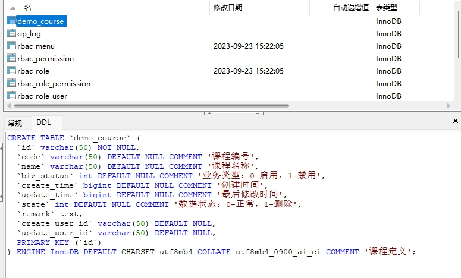
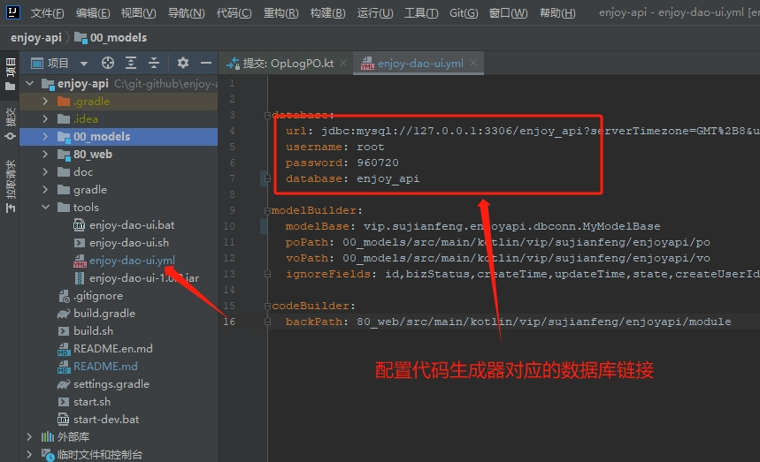
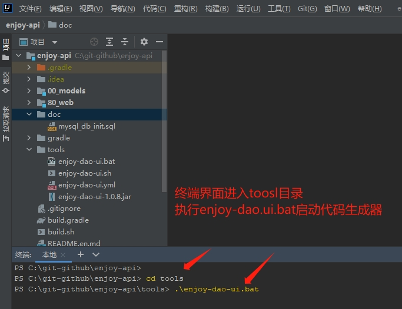
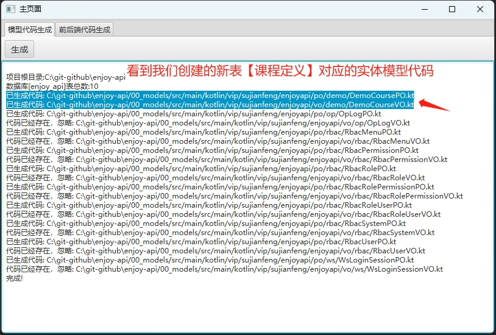
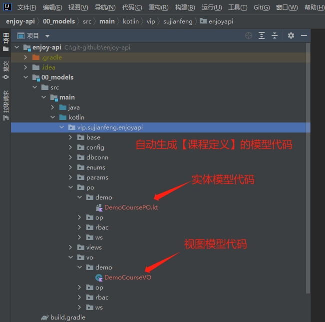
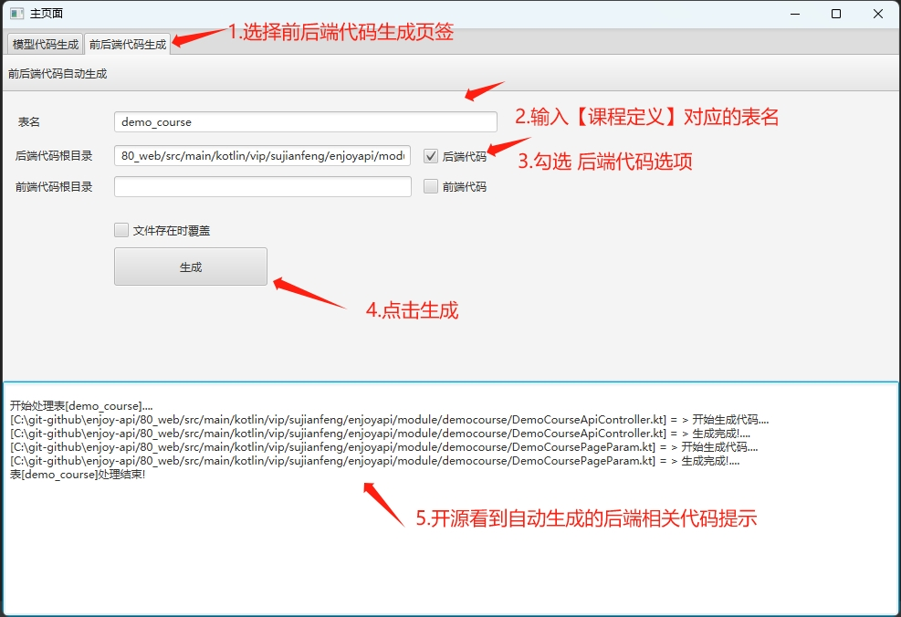
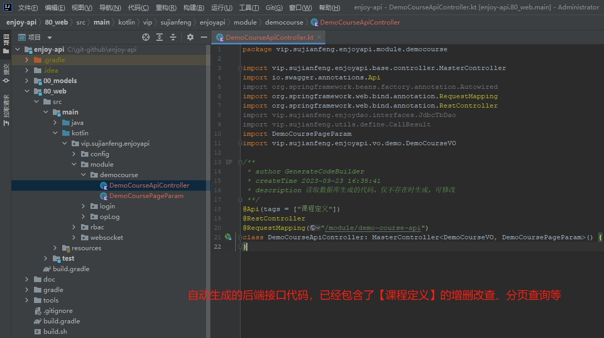

# enjoy-api
【乐享后端】一款开箱即用的开源后端接口基础框架
# 1. 项目环境
    JDK 1.8 +
    Gradle 7.0 +
    MySql 8.0 +
# 2. 项目初始化
## （1）数据库初始化
    运行 doc/mysql_db_init.sql
## （2）配置文件 
    配置文件：    
    80_web/src/main/resources/application-dev.yml （开发环境）
    80_web/src/main/resources/application-test.yml （测试环境）
    80_web/src/main/resources/application-prod.yml （生产环境）
## （3）数据库配置
    配置文件中：
    spring: 
      datasource:
        url: jdbc:mysql://127.0.0.1:3306/enjoy_admin?serverTimezone=GMT%2B8&useUnicode=true&characterEncoding=utf8&autoReconnect=true&failOverReadOnly=false
        username: root
        password: 960720
        database: enjoy_admin
## （4）配置缓存库
    spring:
      redis:
        database: 12
        host: 127.0.0.1
        port: 6379
# 3. 项目启动
## (1) 项目编译打包
    gradle build -x test
## (2) 项目启动
    开发环境启动
    java -jar ./output/jars/80_web-1.0.0-SNAPSHOT.jar --spring.profiles.active=dev
## (3) 查看接口文档
    http://127.0.0.1:8080/doc.html
# 4. 开发新功能接口案例
## (1) 案例描述
    我们以开发一个课程定义模块，包含课程的增删改查接口api
## (2) 创建表结构SQL
    -- ----------------------------
    -- Table structure for `demo_course`
    -- ----------------------------
    DROP TABLE IF EXISTS `demo_course`;
    CREATE TABLE `demo_course` (
    `id` varchar(50) NOT NULL,
    `code` varchar(50) DEFAULT NULL COMMENT '课程编号',
    `name` varchar(50) DEFAULT NULL COMMENT '课程名称',  
    `biz_status` int DEFAULT NULL COMMENT '业务类型：0-启用，1-禁用',
    `create_time` bigint DEFAULT NULL COMMENT '创建时间',
    `update_time` bigint DEFAULT NULL COMMENT '最后修改时间',
    `state` int DEFAULT NULL COMMENT '数据状态：0-正常，1-删除',
    `remark` text,
    `create_user_id` varchar(50) DEFAULT NULL,
    `update_user_id` varchar(50) DEFAULT NULL,
    PRIMARY KEY (`id`)
    ) ENGINE=InnoDB DEFAULT CHARSET=utf8mb4 COLLATE=utf8mb4_0900_ai_ci COMMENT='课程定义';

## (3) 配置代码生成工具的数据库链接

## (4) 启动代码生成工具
    进入项目中的tools目录，windows运行enjoy-dao-ui.bat，liunx或mac运行enjoy-dao-ui.sh
    
## (5) 代码生成工具启动时自动创建表对应的实体模型

## (6) 【课程定义】模型代码

## (7) 代码生成工具生成【课程定义】的后端接口api代码

## (8) 项目打包
    gradle build -x test
## (9) 启动项目，查看下接口文档
    运行 start-dev.bat
    http://127.0.0.1:8080/doc.html
